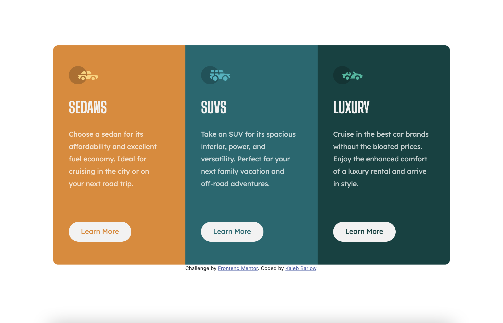

# Frontend Mentor - 3-column preview card component solution

This is a solution to the [3-column preview card component challenge on Frontend Mentor](https://www.frontendmentor.io/challenges/3column-preview-card-component-pH92eAR2-). Frontend Mentor challenges help you improve your coding skills by building realistic projects.

## Table of contents

- [Overview](#overview)
  - [The challenge](#the-challenge)
  - [Screenshot](#screenshot)
  - [Links](#links)
- [My process](#my-process)
  - [Built with](#built-with)
  - [What I learned](#what-i-learned)
  - [Continued development](#continued-development)
  - [Useful resources](#useful-resources)
- [Author](#author)
- [Acknowledgments](#acknowledgments)

## Overview

### The challenge

Users should be able to:

- View the optimal layout depending on their device's screen size
- See hover states for interactive elements

### Screenshot

### Links

- Solution URL: [Add solution URL here](https://github.com/kalebbarlow/3-column-preview-card-component)
- Live Site URL: [Add live site URL here](https://kalebbarlow.github.io/3-column-preview-card-component/)

## My process

### Built with

- Semantic HTML5 markup
- CSS custom properties
- Bootstrap

### What I learned

I learned a lot through this exercise. For example, I was working with my custom stylesheet over the bootstrap framework in my index file for a while until I realized that is why none of my css was working. Completing this project taught me that I need to search A LOT on how to do certain things. This project was super fun and I will be looking forward to completing more in the future. I don't think my html and css is perfect so I would love some feedback on what I can do to improve the spacing of elements, responsiveness of the columns, and the overall layout of the cards!

To see how you can add code snippets, see below:

### Continued development

In the future, I am going to continue to fine-tune my skills with Bootstrap. I would also like to continue learning how to design projects with my own pure css, not with a library. Writing the html was a little harder than I thought, I had to look back at a previous project for reference. Learning to write html without help is my next goal.

### Useful resources

- [W3 Schools](https://www.w3schools.com/) - This helped me solve a lot of my issues with basic css and html.
- [Bootstrap Docs](https://getbootstrap.com/docs/5.0/getting-started/introduction/) - This website helped me understand and fix a lot of my code when I was struggling to find the answer with bootstrap elements.

## Author

- Website - [Kaleb]()
- Frontend Mentor - [@kalebbarlow](https://www.frontendmentor.io/profile/yourusername)
- Twitter - [@yourusername](https://www.frontendmentor.io/profile/kalebbarlow)
